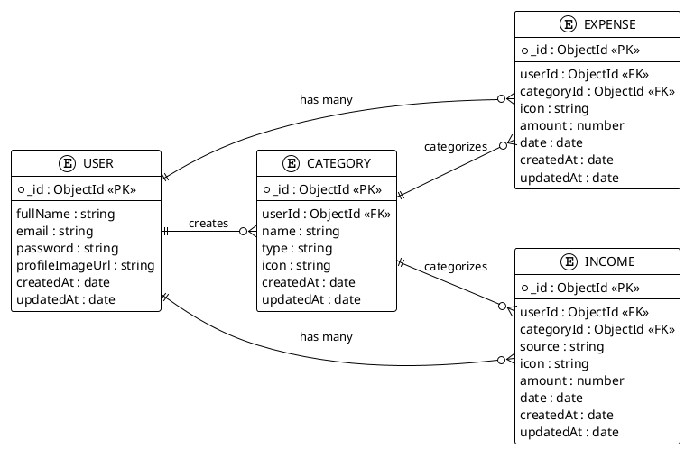

# 📊 ERD – MongoDB AiMonney

```plantuml
@startuml
!theme plain
left to right direction

entity "USER" as USER {
    * _id : ObjectId <<PK>>
    --
    fullName : string
    email : string
    password : string
    profileImageUrl : string
    createdAt : date
    updatedAt : date
}

entity "CATEGORY" as CATEGORY {
    * _id : ObjectId <<PK>>
    --
    userId : ObjectId <<FK>>
    name : string
    type : string
    icon : string
    createdAt : date
    updatedAt : date
}

entity "EXPENSE" as EXPENSE {
    * _id : ObjectId <<PK>>
    --
    userId : ObjectId <<FK>>
    categoryId : ObjectId <<FK>>
    icon : string
    amount : number
    date : date
    createdAt : date
    updatedAt : date
}

entity "INCOME" as INCOME {
    * _id : ObjectId <<PK>>
    --
    userId : ObjectId <<FK>>
    categoryId : ObjectId <<FK>>
    source : string
    icon : string
    amount : number
    date : date
    createdAt : date
    updatedAt : date
}

USER ||--o{ CATEGORY : "creates"
USER ||--o{ EXPENSE : "has many"
USER ||--o{ INCOME : "has many"
CATEGORY ||--o{ EXPENSE : "categorizes"
CATEGORY ||--o{ INCOME : "categorizes"

@enduml

```